= Thread

== 1. process vs thread

=== Process vs Thread

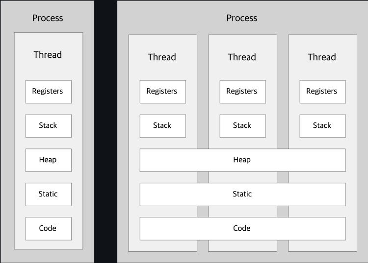

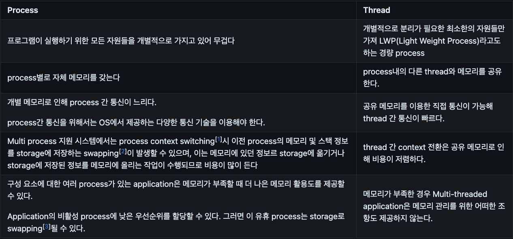

== 2. thread_class_extension

=== Thread class

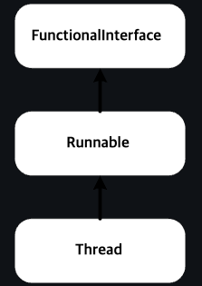
Figure 1. Thread class hirerachy

* Counter Class와 ThreadCounter
** CounterClass -> run() 함수만 구현.
** ThreadCounter -> extends Thread.
** CounterClass는 두 개의 인스턴스 객체를 생성해도 하나처럼 동작, ThreadCounter는 두 개의 인스턴스 객체를 생성하면 두 개가 각각 따로 동작.

== 3. Runnable 인터페이스 구현

=== Runnable 인터페이스 구현

* thread 생성은 클래스 상속 외에 Runnable interface를 통해서도 가능하다.
* Thread class의 상속도를 보면 Thread 클래스도 Runnable 인터페이스를 구현하여 정의되었음을 알 수 있다.
//-
* 참고
** Runnable 인터페이스의 구현은 Thread 클래스와 달리 단독 실행이 불가능하며, Thread 크랠스의 지원이 필요.
** Runnable 인터페이스를 이용할 경우, 스레드에 메인 기능은 run 함수를 overriding해서 사용.
** Runnable 인터페이스를 이용할 경우, 스레드 이름 변경이 불가능하다.
*** setName() 함수는 thread 클래스에서 지원하는 함수.
* Thread 클래스와 Runnable 인터페이스의 차이
** run()을 호출하는 것은 생성된 스레드 객체를 실행하는 것이 아니라, 단순히 스레드 클래스 내부의 run 메서드를 실행시키는 것이다. 즉, main 함수의 스레드를 그대로 사용해서 run 메서드를 실행하기 때문에 새로운 스레드가 생기지 않고 병렬처리를 할 수 없다.
** start()를 호출하면 스레드를 새롭게 생성해서 해당 스레드를 runnable 한 상태로 만든 후 run() 메서드를 실행하게 된다. 따라서 start()를 호출해야만 멀티스레드로 병렬 처리가 가능해진다.

== Thread object 관리
* Runnable interface를 통해 thread를 구현한 경우 별도의 thread object의 관리가 필요하다.
** 1. 생성 후 종료될 때 자동 삭제되도록 한다.
** 2. 구현되는 class 내에 Thread object를 포함시켜 관리한다.
** 3. Thread Pool을 이용한다.

* 1. 생성 후 종료될 때 자동 삭제
** Thread는 Runnable interface의 run() 수행이 끝나면 종료된다. 따라서, 일정한 작업을 외부의 간섭없이 수행하고 종료된다면 운영상에 크게 문제는 없다. 다만, 해당 thread를 원하는 시점에 종료시키거나 관련 정보 확인이 어렵다.

* 2. 구현되는 class내에서 Thread를 field로 포함
** Runnable interface를 구현하는 class가 필요로 하는 Thread instance를 class 내에 포함시켜 관리할 수 있다. 이경우, 생성던 object에서 자신과 관련된 Thread instance를 관리하므로, thread 제어와 관련된 처리가 가능하다.

* 3. Thread Pool을 이용해 관리
** Thread instance의 생성과 삭제를 반복하지 않고 생성된 Thread instance를 활용하므로 자원 활용면에서 좋다. 하지만, 이 방법은 Thread 관리에 대한 권한이 직접적으로 가지고 있지 못해 Thread 제어가 필요한 경우 사용에 제한이 될 수 있다.

== 4. thread_class_vs_runnable_interface

=== Class 확장과 Interface 구현을 이요한 thread 표현 비교

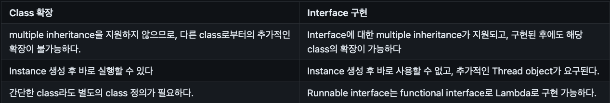

== 5. stop

=== Thread 멈추기
* Java의 thrad는 start()에 의해 시작되지만, 종료에 대한 명령이 없다. 정확히는 초기 버전에서는 stop()을 지원하였으나, 현재는 안전성을 이유로 사용하지 않을 것을 권장한다.
* stop()은 thrad를 즉시 중단시키는 method로서, thread가 실행 중인 상태에서 강제로 종료시켜 thread 내부에서 리소스 정리를 제대로 할 수 없게 되고, 이로 인해 프로그램이 예기치 않게 동작할 수도 있다.
* 또한, stop()으로 lock을 해제하지 않은 채 thread를 종료시켜 다른 thread에서 lock 획득을 위해 무한히 기다리는 deadlock 상태에 빠질 수 있다.

=== thread statemenet

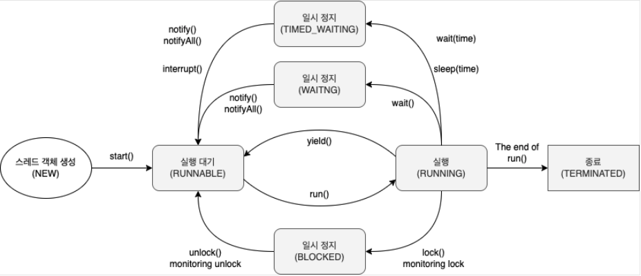

image::image/Threadstatement2.png[]

.상태 제어 이용하기
* boolean값 running 변수, flag를 통해 상태 제어.
** 문제점 : 두 개의 스레드를 각각 실행 후 5초, 10초 뒤에 멈추려면 Thread.sleep(5000) 종료문 Thread.sleep(5000) 종료문 이런식으로 써야 한다.

.Interrupt 이용하기
* 외부에서 thread명.interrupt()

== 6.synchronization

=== Race Condition

* 하나 이상의 thread가 경쟁하는 문제를 race condition이라고 하고, 동시 접근을 함으로써 문제가 발생할 수 있는 구역을 Critical Section(임계구역)이라 한다.

.Critical Section
* Critical section은 thread에서 작업에 필요한 최소한의 시간 동안만 유지되어야 하고, 작업이 완료된 후에는 반드시 해제되어야 한다.

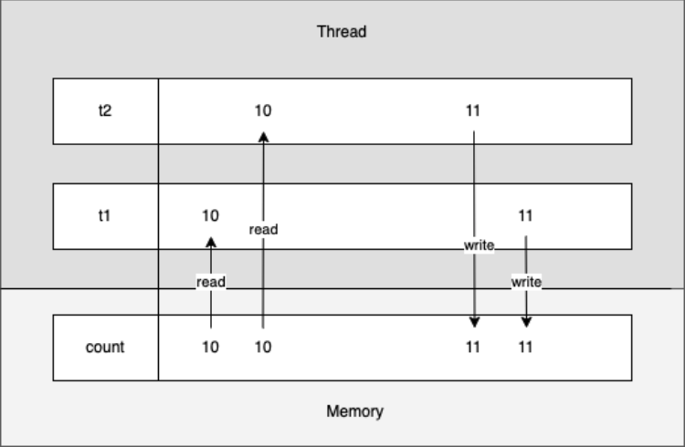

.Mutual Exclusion
* Mutual exclusion이란 두 개 이상의 process 혹은 thread가 동시에 하나의 공유 자원으로 발생할 수 있는 race condition 문제를 해결하기 위해 어느 시점에서의 공유 자원 접근을 하나의 process 혹은 thread로 제한하는 것을 말한다.

.Deadlock
* mutual exclusion 과정에서 자원 접근 권한 획득과 자원 접근 권한 반환 관계의 꼬임으로 발생한다.
* Hold and Wait
** Hold and Wait 아래 그림과 같이 process 2와 같이 resource 1의 접근 권한을 획득한 상태에서 resource 2의 접근 권한을 기다리고 있는 것을 말한다.

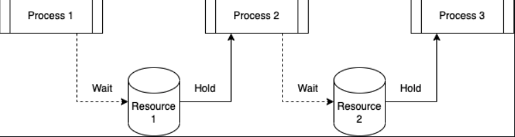

* Circular Wait
** CircularWait은 점유 대기와 공유 자원 획득 후 다른 공유 자원 획득 시까지 무한 대기 상태는 동일하지만, 대기 관계가 아래 그림과 같이 순환 구조를 이루고 있다.

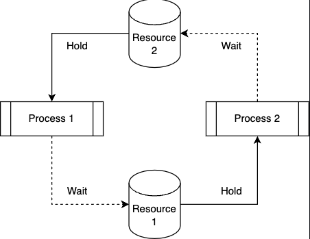

*Starvation
** 다른 process나 thread가 공유 자원의 접근 권한을 지속적으로 가짐으로써 발생할 수 있다. process나 thread가 공유 자원의 접근 권한을 해제하더라도 운영 방식등의 이유로 인해 해당 process나 thread가 공유 자원의 접근 권한을 획득하지 못하는 경우도 동일하다. process나 thread의 우선순위가 다를 경우, 우선순위가 낮은 process나 thread는 scheduler에 의해 공유 자원에 대한 접근 권한을 획득할 만큼의 수행 시간을 갖지 못해 무한히 대기 상태에 놓일 수 있다.

* Livelock
** Livelock은 deadlock 문제를 해결하기 위해 공유 자원 접근 요청 후 일정 시간 안에 권한 획득에 실패한 경우, 수행 과정을 종료하면서 발생할 수 있다.
두 개의 process나 thread에서 교착 상태를 유지하다 일정 시간 후 자원 접근 요청을 철회할 때, 두 개의 process나 thread가 동시에 수행하여 자신이 확보하고 있던 공유 자원 접근 권한을 반환하여 교착 상태가 해결된다. 하지만, 두 개의 process나 thread는 교착 상태와 같이 아무런 작업을 수행하지 못하는 것은 아니지만, 해당 자원에 대한 접근 권한을 확보하지 못해 관련된 작업을 수행하지 못하는 결과를 가져온다.
교착 상태는 관련된 process나 thread가 대기 상태를 계속 유지함으로써 여타의 작업 수행이 불가능하지만 livelock은 해당 자원에 대한 작업만 처리하지 못할 뿐 나머지 작업은 처리되는 차이를 가지고 있다.

.Synchronized
* Java에서는 thread 동기화를 위해 synchronized[1] keyword를 다양한 곳에 적용할 수 있다.
** Instance methods
** Static methods
** Code blocks

== 7.State

.Thread Life Cycle
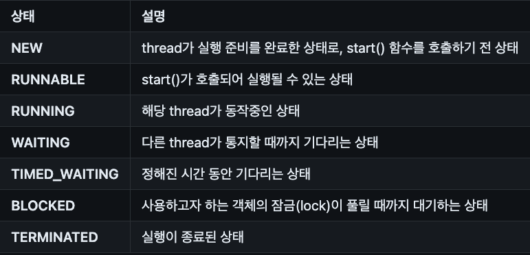

.Block vs Waiting
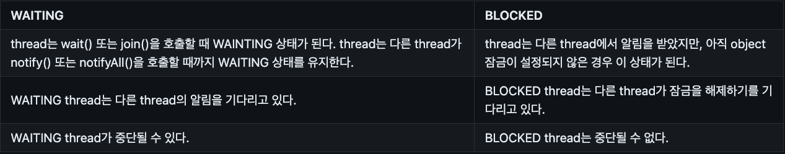

.Thread 상태 제어
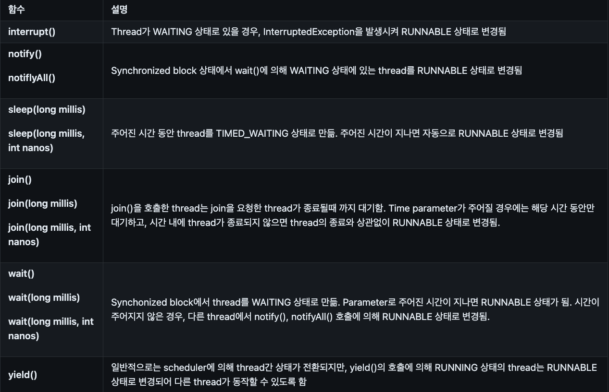

== 9.Daemon Thread

.User Thread vs Daemon Thread
* Java에서의 thread는 user thread와 daemon thread로 나뉜다.
* User thread는 특별히 daemon thread로 설정하지 않은 thread로서 일반적으로 생성해서 사용되는 thread이다.
* JVM은 모든 user thread가 종료될 때까지 프로그램을 실행한다.
* Daemon thread는 백그라운드에서 동작하는 thread로, user thread가 종료될 때 자동으로 종료된다.
* 주로 main thread나 다른 user thread의 보조 역할을 수행하거나, 특정 작업을 주기적으로 처리하는 thread 등에 사용된다.
* JVM은 모든 user thread가 종료되면 daemon thread를 강제로 종료합니다.
* internal thread가 daemon thread이고 외부의 thread는 user thread인 경우 user thread에 interrupt를 주면 internal thread는 살아서 작동한다.