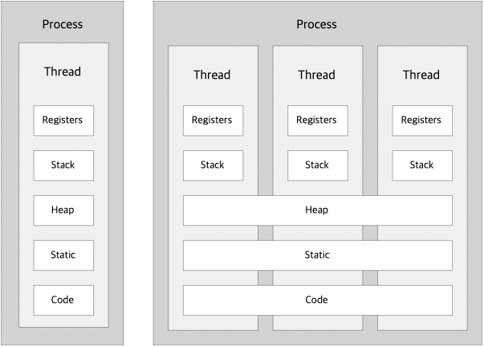
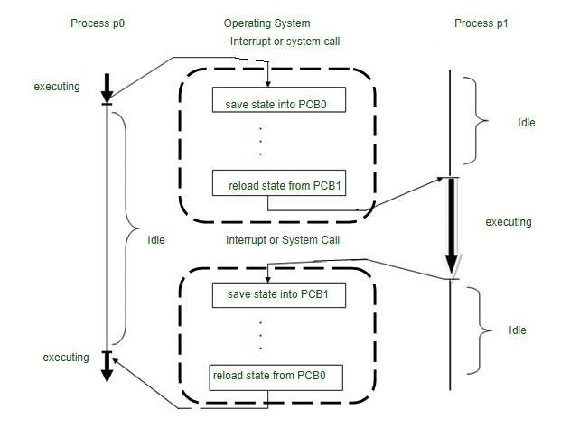
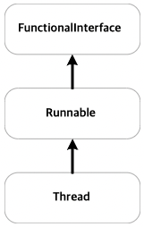
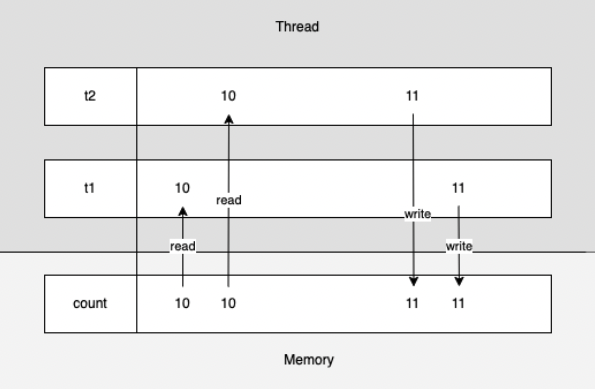
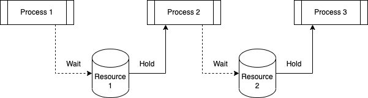
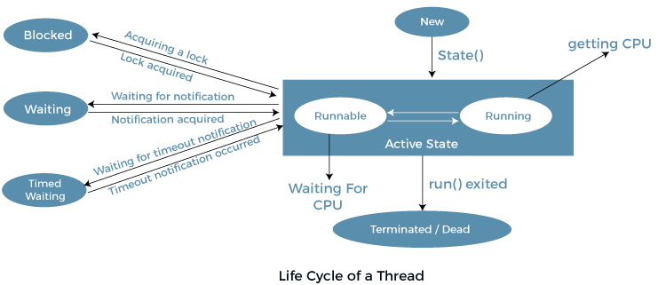
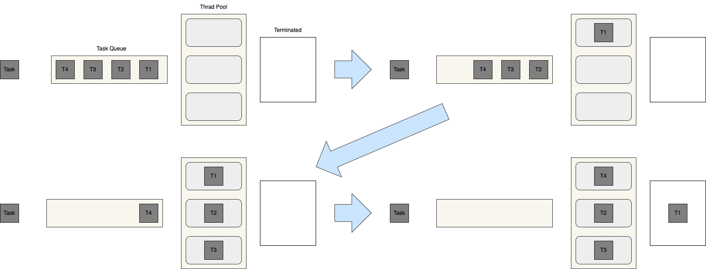

= Java Thread Programming

== **Process VS Thread**

{empty} +

=== **Process**
* 실행 중인 프로그램.
* 스케줄링의 대상이 되는 작업.
* 저장소에서 프로그램이 실행되면, 메모리 할당이 이루어지고 할당된 메모리 공간에 바이터리 코드가 올라간다.
** 이 순간부터 process.
* process는 하나 이상의 thread가 존재한다.

{empty} +

=== **Thread**
* process와 유사하지만 다른 thread와 메모리를 공유한다.
* threa별로 register와 stack이 존재한다.

Thread of Control::
image:images/thread.png[]

[source]
----
// 동작중인 process 정보를 확인하는 터미널 명령어
ps -ef
  UID   PID  PPID   C STIME   TTY           TIME CMD
    0     1     0   0 월11AM ??         1:06.26 /sbin/launchd
    0    79     1   0 월11AM ??         0:57.35 /usr/libexec/logd
    0    80     1   0 월11AM ??         0:03.72 /usr/libexec/UserEventAgent (System)
    0    82     1   0 월11AM ??         0:01.04 /System/Library/PrivateFrameworks/Uninstall.framework/Resources/uninstalld
    0    83     1   0 월11AM ??         0:59.33 /System/Library/Frameworks/CoreServices.framework/Versions/A/Frameworks/FSEvents.framework/Versions/A/Support/fseventsd
    0    84     1   0 월11AM ??         0:04.84 /System/Library/PrivateFrameworks/MediaRemote.framework/Support/mediaremoted
    0    87     1   0 월11AM ??         0:30.88 /usr/sbin/systemstats --daemon
  278    88     1   0 월11AM ??         0:00.44 /System/Library/PrivateFrameworks/MobileAccessoryUpdater.framework/Support/accessoryupdaterd 120

// 동작중인 thread 정보를 확인하는 터미널 명령어 -> LWP, NLWP 확인 불가.
ps -elf
  UID   PID  PPID        F CPU PRI NI       SZ    RSS WCHAN     S             ADDR TTY           TIME CMD              STIME
    0     1     0     4004   0  37  0 409088112  21216 -      Ss                  0 ??         1:02.92 /sbin/launchd    월11AM
    0    79     1     4004   0  37  0 408361280  45152 -      Ss                  0 ??         0:55.30 /usr/libexec/log 월11AM
    0    80     1     4004   0  31  0 408267872  17152 -      Ss                  0 ??         0:03.64 /usr/libexec/Use 월11AM
    0    82     1     4004   0  20  0 408058496   3360 -      Ss                  0 ??         0:00.99 /System/Library/ 월11AM
    0    83     1  1004004   0  50  0 408241760   8800 -      Ss                  0 ??         0:56.52 /System/Library/ 월11AM
    0    84     1     4004   0   4  0 408269024  23440 -      Ss                  0 ??         0:04.84 /System/Library/ 월11AM
    0    87     1     4004   0   4  0 408240320  20976 -      Ss                  0 ??         0:28.82 /usr/sbin/system 월11AM
  278    88     1     4004   0   4  0 408230928  13584 -      Ss                  0 ??         0:00.44 /System/Library/ 월11AM
    0    89     1     400c   0  31  0 408270976  15968 -      Ss                  0 ??         0:25.29 /usr/libexec/con 월11AM
    ...
----
* UID - process를 실행한 사용자 ID
* PID - process 식별자
* LWP - process 내에서 thread 식별자
* NLWP - process에서 생성한 thread 개수
* PRI - process 우선 순위
* NI - process의 cpu 자원 우선 순위 (Nice)
* C - CPU 사용량
* SZ - 가상 메모리 사용량
* STIME - process 실행 시간
* TTY - process가 실행된 터미널의 종류와 번호
* ADDR - process의 메모리 주소

{empty} +

=== **Process, Thread 차이점**
[frame=ends, cols="1,1"]
|===
^s| Process
^s| Thread

| 프로그램을 실행하기 위한 모든 자원들을 가지고 있어서 무겁다.
| 개별로 분리가 가능한 최소한의 자원만 가지고 있다. LWP(Light Weight Process)라고도 한다.

| 개별적으로 자원을 가지고 있기 때문에 process간 통신이 느리다.
| 공유 메모리를 통해서 thread간 통신이 빠르다.

| 메모리가 부족해지면 비황성 process에 낮은 우선순위를 할당해 해당 프로세스를 storage로 swapping 할 수 있다.
| 메모리가 부족해지더라도 어떤 관리를 제공하지 않는다.

| 멀티 프로그래밍은 Multi Process의 개념을 가지고 있다.
| 단일 프로세스는 여러 스레드로 구성되기 때문에 multi thread를 위해서 여러 프로그램을 실행할 필요가 없다.

| process 스위칭은 OS의 인터페이스를 사용한다.
| thread 스위칭은 OS를 호출할 필요가 없고 kernel에 interrupt를 발생시킨다.

| 한 프로세스가 Blocked된 상태라면 실행중인 다른 프로세스에 영향을 주지 않는다.
| 한 user-level thread Bloack 상태라면 다른 모든 user-level thread는 Block 상태이다.

|===

{empty} +

=== **Single Thread**
* Main Thread에서 작업을 진행한다. 작업은 순차적으로 진행된다.
* 하나의 process에 하나의 thread로만 실행한다.
** Context Switchind 작업을 요구하지 않는다.
** 동시성 제어에 대한 처리를 신경 쓸 필요가 없다.

=== **Multi Thread**
* 프로그램에 두 개 이상의 동작을 실행한다.
* 한 프로세스를 다수의 실행 단위로 구분해 자원을 공유한다.
** 자원의 생성과 관리의 중복성을 최소화 할 수 있다.
** 수행 능력이 향샹된다.

{empty} +

=== **Context Switching**
시스템에 있는 CPU를 사용하여 프로세스를 한 상태에서 다른 상태로 변경하기 위해서 사용하는 process/method를 나타낸다.

* Context Switching을 통해서 추가 processor없이 한 CPU에서 여러 process들의 요청을 병렬로 처리할 수 있다.

{empty}

Trigger로써의 Context Switching::
1. Interrupt : CPU가 한 disc에서 읽은 data에 대해서 어떤 interruption이 발생한다면 context switching은 자동적으로 더 빨리 interruption을 처리할 수 있는 HW 구성요소로 전환한다.
2. Multitasking : 프로세스가 switch될 때 이전 상태가 유지되어 프로세스가 시스템의 동일한 장소에서 계속 실행 된다.
3. Kernel/User Switch : user mode와 kernel mode 간 변경이 필요한 경우 OS는 Kernel/User Switch를 사용한다.

PCB - Process Control Block::
컴퓨터가 프로세스에 대한 모든 정보를 저장하기 위해서 사용하는 데이터 구조.

{empty} +

== **Thread class extension**
Thread class::

run() vs start()::
run() : 메소드 호출. 쓰레드 생성 X. 싱글 쓰레드에서 동작. +
start() : native 영역에 새로운 Thread가 생성되어 run() 메서드 실행. 멀티쓰레드로 동작.

{empty} +

1. Thread 클래스를 확장하여 thread를 생성할 수 있다.
2. Thread 클래스 인스턴스는 실행시 개별 thread를 생성하여 동작하므로 하나 이상의 thread를 생성할 수 있다.
3. 프로그램이 시작되는 main 함수도 하나의 thread로 동작한다.

== **Runnable interface**
* Runnable interface를 통해서 thread를 이용할 수 있다.
* Thread class도 Runnable interface의 구현으로 정의.
* Runnable interface는 run() 메소드의 구현만 요규하는 functional interface이다.
* Runnable interface 구현 시 실행을 위해서 별도의 Thread 객체가 필요하다.

[source]
----
Thread thread = new Thread(new RunnableCounter("runnableCounter", 10));

thread.start();
----

* Runnable interface 구현을 위해 생성한 Thread 객체는 관리가 필요하다.
1. 생성 후 종료될 때 자동 삭제되도록 한다. +
Runnable interface의 run() 메소드 구현이 종료되면 종료된다. +
해당 thread를 원하는 시점에 종료시키거나 관련된 정보를 확인하기는 어렵다.
2. 구현되는 class 내에 Thread 객체를 포함해 관리한다. +
구현된 class에서 Thread 객체를 관리하므로, thread 제어와 관련된 처리가 가능해진다.
3. Thread Pool을 이용한다. +
Thread 객체의 생성과 삭제를 반복하지 않고 이미 생성된 Thread 객체를 이용하므로 자원 활용면에서 좋다. +
하지만 Thread 관리에 대한 직접적인 권한이 없기 때문에 제어가 필요한 경우 사용이 제한적이다.

**Extended class vs implement Runnable**
[frame=ends, cols="1,1"]
|===
^s|Class
^s|interface

|다중 상속을 지원하지 않으므로 다른 class로의 추가적인 확장이 불가능하다.
|interface에 대한 다중 상속이 지원되고 구현 이후 확장이 가능하다.

|instance 생성 후 바로 실행이 가능하다.
|추가적인 thread 객체가 필요하다.

|별도의 class 정의가 필요하다.
|lamdda로 class를 정의하지 않고 구현이 가능하다.
|===

{empty} +

== **Thread Stop**
* Java의 thread는 start() 메서드로 실행 되지만 별도의 종료 명령이 없다.
** stop() 메서드를 통해서 thread를 종료할 수 있지만 thread를 즉시 종료 시키므로 thread 내부의 자원을 제대로 정리하지 못하게 된다. 
** 또한 lock 상태에서 종료 시 다른 thread가 해당 자원을 획득하기 위해서 무한히 기다리는 deadlock 상태에 빠질 수 있다.
* Thread를 안전하게 종료하려면 thread 내에서 확인 가능할 수 있도록 상태를 전달해 스스로 종료하도록 해야한다.

{empty} +

상태 제어 이용하기::

Interrupt 이용하기::
java Thread class에는 sleep이나 wait 상태일때 외부에서 이벤트를 전달 받을 수 있는 interrupt가 지원된다. +
interrupt는 thread class의 상태 정보로 이용되지만 sleep이나 wait 상태에서 exception을 발생 시킬 수 있다. +
wait 상태의 thread를 runnable 상태로 변경이 가능하다.

== **Syncronization**

Race Condition::
여러 thread가 동일한 자원에 동시에 접근하는 경우.
* 여러 thread가 동시에 같은 값을 읽어서 결국 한 thread에 의해서 변경된 값은 사라지고 마지막에 쓴 thread의 값이 저장되어 원하는 결과를 얻지 못하는 것.

.Race Condition

critical section(임계구역)::
동시 접근을 함으로써 문제가 발생할 수 있는 구역. 한 thread가 critical section에 들어가 작업을 진행중이라면 나머지 thread들은 해당 작업이 완료될 때 까지 대기해야 한다.

Mutual Exclution(상호배제)::
여러 process 혹은 thread가 하나의 공유 자원에 race condition이 발생하는 것을 해결하기 위해 어느 시점에서의 자원에 대한 접근을 하나의 process 혹은 thread로 제한하는 것.

Deadlock(교착상태)::
mutual exclution 과정에서 자원 접근 권한 획득과 자원 접근 권한 반환 관계의 꼬임으로 발생한다.
1. Hold and Wait(점유 대기) +
 +
하나의 자원에 대한 접근 권한을 획득한 상태로 다른 자원에 대한 접근 권한을 기다리는 것. +
획득하기 위한 접근 권한을 가진 thread나 process가 반환하기 까지 대기해야 한다.
2. Circular Wait(순환 대기) +
image:images/circular_wait.svg[] +
두 개의 process가 서로 다른 process가 가진 접근 권한을 갖기 위해 대기하고 있는 상태.
3. Starvation(기아 상태) +
다른 process나 thread가 공유 자원의 접근 권한을 지속적으로 가짐으로써 발생한다. +
접근 권한을 해제하더라도 운영 방식에 따라서 해당 thread가 접근 권한을 얻지 못하는 경우도 동일하다.
4. LiveLock +
deadlock 문제를 해결하기 위해 자원 접근 요청 후 일정 시간안에 획득에 실패할 경우 수행을 종료하면서 발생할 수 있다. +
두 개의 process가 교착상태를 유지하다 접근 요청을 철회할 때 두 process가 동시에 수행한다면 교착상태는 해결되지만 두 process모두 접근 권한을 확보하지 못해 관련 작업을 수행하지 못하는 결과를 가져온다.

=== **Synchronized**
instance method 동기화::
[source]
----
public synchronized void increment() {...}
----

static methid 동기화::

code block 동기화::
Synchronized는 method 뿐만 아니라 code block에도 가능하다. +
code block 생성 시 lockdmf 설정할 객체가 필요하다.

=== **Synchronization Control**
synchronized method 또는 block에서의 제어.

wait()::
synchronized 영역에서 lock을 소유한 thread가 자신의 제어권을 양보하고 WAITING 또는 TIMED_WAITING 상태에 들어간다. +
Thread에서 wait() 메서드를 호출하기 위해선 lock을 소유한 상태여야 한다. +
notify()나 notifyAll() 메서드가 호출되기 전까지 대기 상태를 유지한다.

notify()::
synchronized 영역에서 WAITING 상태에 있는 thread를 다시 RUNNABLE 상태로 변경하는 역할을 한다. +
wait() 메서드로 대기 상태에 있던 임의의 Thread가 RUNNABLE 상태가 된다.

{empty}

* wait, notify, notifyAll 모두 static method가 아닌 instance method이다.

.Wait and Notify
image:images/wait_and_notify.svg[]

NOTE: **중요사항** +
1. Thread가 synchronized method 또는 block에 들어가면 lock을 획득하고 작업을 완료하면 lock을 해제한다. +
2. Thread가 synchronized instance method 또는 block에 들어가면 object 수준 lock을 획득하고 synchronized static method 또는 block에 들어가면 class 수준의 lock을 획득한다. +
3. Java synchronization은 synchronized block에 사용된 object가 null 인 경우 null point exception을 발생시킨다. +
4. 변수에는 java synchronized keyword를 적용할 수 없다.

NOTE: **이점** +
1. Multi-Thread +
java는 multi-thread 언어이므로 동기화는 공유 자원에서 mutual exclution을 달성하는 좋은 방법이다. +
2. instance method 및 static method +
synchronized instance method와 static method는 서로 다른 object를 lock 하는데 사용 되므로 동시에 실행할 수 있다.

NOTE: **제한 사항** +
1. 동시성 제한 +
동시 읽기를 허용하지 않는다. +
2. 효율성 감소 +
synchronized method는 매우 느리게 실행되며 성능이 저하될 수 있으니 꼭 필요한 경우에만 사용하고 중요한 섹션에 대해서만 블록을 동기화 해야한다.

== **Thread State**

NEW::
thread가 실행 준비를 완료한 상태. start()를 호출하기 전 상태 +
Thread 객체가 생성되었지만 실행은 되지 않은 상태.

RUNNABLE::
start()가 호출되어 실행될 수 있는 상태 +
스케줄러에 의해 실행을 기다리는 상태.

RUNNING::
해당 thread가 동작중인 상태 +
다른 thread에서 확인이 불가능하다.

WAITING::
다른 thread가 notify할 때 까지 기다리는 상태 +
Synchronized block에서 wait(), 다른 threa가 종료되길 기다리는 join()

TIMED_WAITING::
정해진 시간동안 기다리는 상태 +
WAITING과 동일하지만 제한시간 설정이 가능하다.

BLOCKED::
사용하려는 객체의 lock이 풀릴 때 까지 대기하는 상태 +
Synchronized code block을 다른 thread가 점유하고 있는 경우 해당 점유가 끝날 때 까지 기다린다.

TERMINATED::
실행이 종료된 상태

**WAITING VS BLOCKED**
[frame=ends, cols="1,1"]
|===
^s|WAITING
^s|BLOCKED

|Thread는 wait() 또는 join()을 호출할 때 WAITING 상태이다. 다른 thread가 notify() 또는 notifyAll()을 호출할 때 까지 해당 상태를 유지한다.
|Thread는 다른 thread로부터 알림을 받지만 아직 object 잠금히 해제 되지 않은 경우이다.

|다른 thread의 notify를 기다리고 있다.
|object의 lock이 해제되길 기다리고 있다.

|WAITING Thread가 중단될 수 있다.
|BLOCKED Thread는 중단될 수 없다.
|===

{empty} +

=== **Thread 상태 제어**
interrupt()::
Thread가 WAITING 상태인 경우 InterruptException을 발생시켜 RUNNABLE 상태로 변경한다. +

notify(), notifyAll()::
wait() 메서드에 의해서 WAITING 상태인 thread를 RUNNABLE 상태로 변경한다.

sleep(long millis), sleep(long millis, int nanos)::
주어진 시간동안 thread를 TIMED_WAITING 상태로 변경한다. 시간이 지나면 RUNNABLE 상태로 변경된다.

join(), join(long millis), join(long millis, int nanos)::
join()메서드를 호출한 thread는 join()의 대상이 되는 thread가 종료될 때 까지 대기한다. 시간이 주어진다면 해당 시간동안 대상 thread가 종료되지 않으면 다시 RUNNABLE 상태로 변경한다.

wait(), wait(long millis), wait(log millis, int nanos)::
Synchronized block에서 thread를 WAITING 상태로 만든다.

yield()::
RUNNING 상태의 threadsms RUNNABLE 상태가 되고 다른 thread가 동작한다. +
thread가 processor에게 현재 사용을 포기할 의향이 있고, 가능한 빠른 시간 내에 다시 예약 되기를 원한다고 scheduler에게 알리는 기능을 한다. +
하나의 thread가 프로세서를 과도하게 점유하지 않게 조절할 수 있다.

=== **wait() vs sleep()**
* 일정 시간동안 thread의 실행을 일시 정지하는데 사용한다.

[frame=ends, cols="1,1"]
|===
^s|wait()
^s|sleep()

|thread가 가진 객체의 lock을 해제하고 WAITING 상태가 된다.
|thread가 보유하고 있는 lock과 관련 없이 TIMED_WAITING 상태가 된다.

|notify(), notifyAll()과 함께 Thread의 상태를 제어하는데 사용된다.
|특정 시간동안 thread를 일시정지하는데 사용된다.

|java.lang.Object class의 instance method이다.
|java.lang.Thread class의 class method이다.
|===

== **Thread Pool**
* 여러 개의 thread를 만들어 두고 여러 번 재사용 되는 thread 그룹을 나타낸다.
* 고정된 크기로 생성된 thread pool에 Runnable 객체를 주고 실행을 요청하면 pool에서 thread를 가져와 실행한다.
* thread pool에 남아 있는 thread가 없으면 해당 작업은 실행 되지 못하고 대기 상태에 있게 된다.
* 실행을 완료한 thread는 다시 pool로 돌아온다.

=== **장점**
* Thread 생성과 삭제에 따른 시간과 자원을 절약할 수 있다.

=== **주의사항**
* Deadlock
** Multi-Thread와 관련된 모든 프로그램이 교착 상태가 발생할 수 있다.
** 작업 간 데이터의 교환이 필요한 경우, 실행 작업과 대기 작업의 교착 상태가 발생할 수 있다.

* Thread Laekage
** 비정상 종료에 의한 실행 종료

* Resource Thrashing
** 지나치게 큰 thread pool을 사용하면 thread 간 context switching시에 느려지는 문제가 발생할 수 있다.

== **Daemon**
* Java에서 Thread는 User Thread와 Demon Thread로 나뉜다.
* User Thread는 특별히 Deamon Thread로 지정하지 않은 Thread이다.
* JVM은 모든 User Thread가 종료되면 Deamon Thread를 강제 종료 시킨다.

