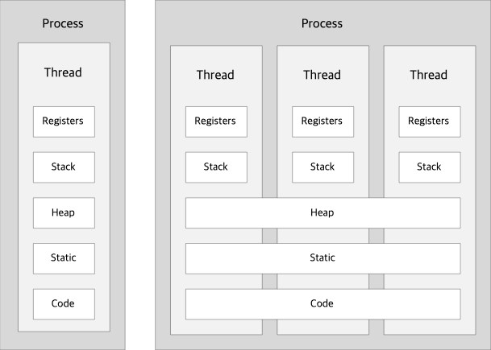

= Process vs Thread

== Process
* 실행중인 프로그램
* 스케줄링의 대상이 되는 작업(task)
* proces는 하나 이상의 스레드로 구성 (Single Thread)

== Thread
* process와 유사하지만, Heap, Stack, Code 부분을 공유한다
* Thread별로 Stack, Register를 가짐
* 두 개 이상의 동작을 동시에 실행 -> 자원 생성과 관리의 중복성 최소화, 수행 능력 향상

== Process vs Thread
[]
[cols="3*^", %autowidth, options=header]
|===
|
| Process
| Thread

| *Weight*
| 프로그램 실행에 필요한 자원을 각자 가지고 있어 무거움
| 분리가 필요한 최소한의 자원들만 가짐 _LWP(Light Wieght Process)_

| *Memory*
| 프로세스별로 자체 메모리를 가짐
| 프로세스 내의 다른 thread와 메모리 공유

| 통신
| 개별 메모리로 인해 프로세스간의 통신이 느리고, 통신을 위해서 OS가 제공하는 기술을 사용해야 함
| 공유 메모리를 이용한 직접 통신이 가능 -> thread간 통신이 빠름

| Context Swtiching
| 멀티 프로세스의 경우 이전 프로세스의 정보를 storage에 저장하는 swapping이 발생할 수 있어 비용이 많이 든다.
| thread간 context switching은 공유 메모리로 인해 비용이 저렴하다.

| Out of Memory
| 구성 요소에 대한 여러 프로세스가 있는 Application은 메모리가 부족할 때 더 나은 메모리 활용도를 제공할 수 있음.
Application의 비활성 process에 낮은 우선순위 할당하는 방식 -> 유휴(작업시간이 없는) 프로세스는 storage로 swapping
| 메모리가 부족한 경우 Multi-threaded application은 메모리 관리를 위한 어떠한 조항도 제공하지 않음.

