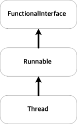

= Runnable interface

== 목표
* Runnable interface를 구현해 thread로 동작하는 클래스를 만든다.
* Runnable interface 구현을 통해 여러 작업을 동시에 실행해 확인

== Runnable Interface

* 위의 이미지와 같이 Thread는 Runnable interface의 구현으로 정의됨.

Quiz-01. Runnable interface를 이용해 RunnableCounter class 구현
[source,java]
----
public class RunnableCounter implements Runnable {
    private String name;
    private int maxCount;

    public RunnableCounter(String name, int maxCount) {
        this.name = name;
        this.maxCount = maxCount;
    }

    @Override
    public void run() {
        for (int i = 0; i < maxCount; i++) {
            System.out.println(name + " : " + (i + 1));
            try {
                Thread.sleep(1000);
            } catch (InterruptedException e) {
                throw new RuntimeException(e);
            }
        }
    }

    public static void main(String[] args) {
        Thread thread = new Thread(new RunnableCounter("runnableCounter", 10));
        thread.start();
    }
}
----

== Thread object 관리
* Runnable interface로 만든 thread는 별도의 관리가 필요
1. 생성 후 종료될 때 자동 삭제
2. 구현되는 class내에 Thread object를 포함시켜 관리
3. Thread pool 이용

=== 1. 생성 후 종료될 때 자동 삭제
* Thread는 Runnable interface의 run() 메서드가 끝나면 종료된다.
* 따라서, 일정한 작업을 외부의 간섭없이 수행하고 종료된다면 크게 문제는 없다.
* 하지만, 해당 thread를 원하는 시점에 종료시키거나 관련 정보를 확인하기 어려움

Exam-01. Thread object 생성 후 종료될 때 자동 삭제
[source,java]
----
import example.RunnableCounter;

public class Exam01 {
    public static void main(String[] args) {
        RunnableCounter counter = new RunnableCounter("counter", 5);
        Thread thread = new Thread(counter);

        thread.start();
    }
}
----

=== 2. 구현되는 class내에 Thread를 filed로 포함
* 생성된 object에서 자신과 관련된 Thread instance를 관리
* thread 제어와 관련된 처리가 가능

Exam-02. RunnableCounter에 Thread field를 추가

_class SelfRunnableCounter_
[source,java]
----
package example;

public class SelfRunnableCounter implements Runnable {

    private int count;
    private int maxCount;
    private Thread thread;

    public SelfRunnableCounter(String name, int maxCount) {
        this.maxCount = maxCount;
        this.count = 0;
        this.thread = new Thread(this, name);
    }

    public void start() {
        thread.start();
    }

    @Override
    public void run() {
        while (count < maxCount) {
            try {
                ++count;
                System.out.println(thread.getName() + " : " + count);
                Thread.sleep(1000);
            } catch (InterruptedException e) {
                Thread.currentThread().interrupt();
            }
        }
    }
}
----

_Exam02 class_
[source,java]
----
package exercise;

import example.SelfRunnableCounter;

public class Exam02 {

    public static void main(String[] args) {
        SelfRunnableCounter counter = new SelfRunnableCounter("counter", 5);

        counter.start();
    }
}
----

=== 3. Thread pool을 이용해 관리
* 첫 번째 방법과 유사하나, 생성된 Thread instance를 활용하므로 자원 활용면에서 좋다.
* 하지만, 이 방법은 Thread 관리에 대한 권한이 직접적으로 가지고 있지 못해 Thread 제어가 필요한 경우 사용에 제한이 될 수 있음.

Exam-03. Thread pool을 이용해 RunnableCounter 실행
[source,java]
----
package example;

import java.util.concurrent.ExecutorService;
import java.util.concurrent.Executors;
import java.util.concurrent.TimeUnit;

public class ThreadPool {

    public static void main(String[] args) throws InterruptedException {
        ExecutorService pool = Executors.newFixedThreadPool(2);
        pool.execute(new RunnableCounter("counter1", 5));
        pool.execute(new RunnableCounter("counter2", 5));

        pool.shutdown();
        System.out.println("Shutdown called");
        while(!pool.awaitTermination(2, TimeUnit.SECONDS))  {
            System.out.println("Not yet finished!");
        }
        System.out.println("All service finished");
    }
}

----