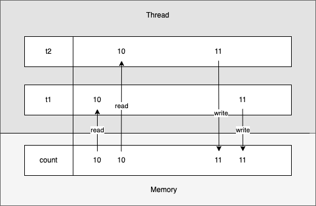
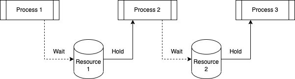
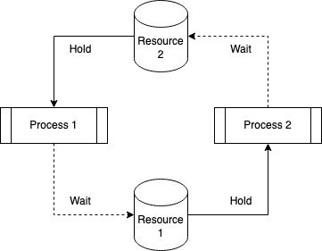
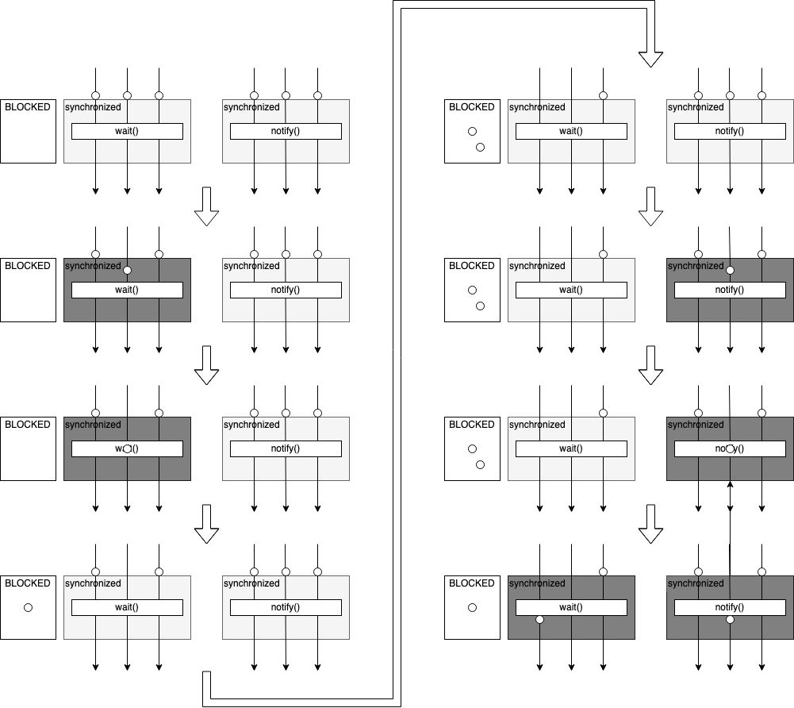

= Thread 동시성 제어

== Thread 동기화 문제

=== Race Condition (경쟁 조건)
* 둘 이상의 thread가 동시에 공유 자원 접근시 발생

link:exam01/[Exam-01. 공유 count를 갖는 SharedCounter - Race Condition]

* 위의 사진과 같은 문제로 인해 원하는 값(20000)이 아닌 다른 값이 출력되는 것을 알 수 있음.

==== Critical Section (임계 구역)
* 동시 접근이 허용되지 않는 공유 자원에 접근하는 코드 블록
* Critical Section은 최소한의 시간 동안만 유지되어야 하고, 작업이 완료된 후 반드시 해제해야 함.
* Mutual Exclusion을 보장
* 하나의 thread가 임계 구역에 접근하면 다른 thread들은 작업이 완료될 때 까지 대기

==== Mutual Exclusion (상호 배제)
* 동시에 하나의 공유 자원으로 발생할 수 있는 Race condition 문제를 해결하기 위한 방법
* 어느 시점에 공유 자원에 하나의 프로세스(thread)만 접근 가능하도록 제한하는 것을 의미

=== Deadlock (교착 상태)
* Mutual Exclusion 과정에서 자원 접근 권한 획득과 반환 관계의 꼬임으로 인해 발생

==== Hold and Wait (점유 대기)

* process 2의 수행 과정이 resource 2의 접근 권한을 획득하여 처리한 후 resource 1의 접근 권한을 해제한다고 가정해보자.
* process 2는 process 3가 접근 권한을 해제하기 전까지는 무한 대기 상태가 된다.
* 또한, process 2가 resource 1을 Hold하는 상태이기 때문에 process 1도 무한 대기 상태

==== Circular Wait

* 두 개의 process는 서로 다른 process가 가지고 있는 접근 권한을 얻기 위해 대기
* 하나의 process가 먼저 해제를 하지 않는 이상 무한 대기 상태가 유지됨.

==== Starvation (기아 상태)
* 다른 프로세스가 공유 자원의 접근 권한을 지속적으로 가질 때 발생
* 우선순위가 낮은 프로세스는 scheduler에 의해 접근 권한을 획득할 만큼의 수행 시간을 갖지 못해 무한 대기 상태가 될 수 있음.

=== Livelock
* Deadlock 문제를 해결하기 위한 방법
* 공유 자원 접근 요청 후 일정 시간 후에 권한 획득을 실패할 경우, 수행 과정을 종료하면서 발생
* 해당 자원에 대한 작업만 처리하지 못할 뿐 나머지 작업은 처리한다는 점에서 Deadlock과 차이를 가짐.

{empty} +

== Synchronized
* Java에서는 thread 동기화를 위해 `synchronized` keyword를 다양한 곳에 적용할 수 있다.

=== Instance method synchronized
link:exam02/[Exam-02. race condition 문제를 synchronized keyword로 해결]

* 동적으로 생성된 instance variable에 적용

=== Static method synchronized
link:exam03/[Exam-03. race condition 문제를 static instance를 생성하고, synchronized keyword로 해결]

* class loading 시점에 생성되는 static variable에 적용

=== Code block synchronized
* 동기화를 위해 반드시 해당 object의 class에서 적용되어야 하는가?
* synchronized는 메서드 뿐 만 아니라 별도의 code block에도 적용 가능
* 다만, code block 생성시 lock을 설정할 object가 필요

link:exam04/[Exam-04. race condition 문제를 SharedCount object와 synchronized code block로 해결]

== Synchronization Control
* 자바에서는 synchronized method 또는 block에서의 제어를 위해 wait, notify 지원
1. wait() : synchronized 영역에서 lock을 소유한 thread가 제어권 양보, WAITING 또는 TIMED_WAITING 상태에서 대기
2. notify() & notifyAll() : synchronized 영역에서 WAITING 상태에 있는 다른 thread를 다시 RUNNABLE 상태로 변경

> wait, notify, notifyAll은 Thread의 static method가 아닌 instance method라는 점

link:exam05/[Exam-05. wait and notify method in Java]

{empty} +

=== 주요 사항
* Thread가 synchronized method 또는 block에 들어가면 잠금을 획득하고 작업을 완료하고 synchronized method를 종료하면 잠금을 해제한다.
* Thread가 synchronized instance method 또는 block에 들어가면 object 수준 잠금을 획득하고 synchronized static method 또는 block에 들어가면 class 수준 잠금을 획득한다.
* Java synchronization은 sychronized block에 사용된 object가 null인 경우 null point exception를 발생시킵니다.
* Java에서 `wait()`, `notify()` 및 `notifyAll()` 은 syncrhonization에 사용되는 중요한 방법이다.
* 변수에는 java synchronized keyword를 적용할 수 없다.
* final이 아닌 field에 대한 참조는 언제든지 변경될 수 있으며 다른 object에서 서로 다른 thread가 synchronization될 수 있으므로 synchronized block의 final이 아닌 field에서 동기화하지 말라.

=== 이점
* Multi-thread
** Java는 multi-thread 언어, 동기화(synchronized)는 공유 자원에서 상호 배제를 달성하는 좋은 방법
* Instance method & static method
** synchronized instance method & static method는 서로 다른 객체(object)를 잠그는데 사용되므로 동시에 실행 가능

=== 제한 사항
* 동시성 제한
** Java 동기화(synchronized)는 동시 읽기를 허용하지 않음.

* 효율성 감소
** Java에서 synchronized method는 매우 느리게 실행
** 이는 성능 저하를 일으킬 수 있으므로 꼭 필요한 경우에만 동기화하고 중요한 섹션에 대해서만 블록을 동기화해야 한다.