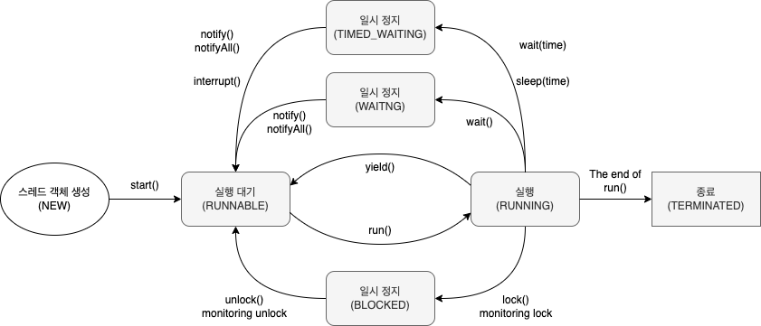

= Thread 상태

== 생명주기

**Thread 6가지 상태**
[cols="2*^", %autowidth, options=header]
|===
| 상태 | 설명
| NEW | thread가 실행 준비를 완료한 상태, start() 메서드 호출하기 전
| RUNNABLE | start() 메서드가 호출되어 실행될 수 있는 상태
| RUNNING | 해당 thread가 동작중인 상태
| WAITING | 다른 thread가 notify()할 때까지 기다리는 상태
| TIMED_WAITING | 정해진 시간 동안 기다리는 상태 (제한 시간 내에 알림을 받지 못하면 WAITING 해제 후 RUNNABLE 상태로 변경)
| BLOCKED | 사용하고자 하는 객체의 잠금(lock)이 풀릴 때 까지 대기하는 상태
| TERMINATED | 실행이 종료된 상태
|===

{empty} +

=== BLOCKED vs WAITING
* 둘 다 대기 상태이지만, 설정과 해제를 위한 조건에 차이가 존재

1. WAITING
** wait(), join() 호출할 때의 상태
** 다른 thread가 notify(), notifyAll()을 호출할 때까지 WAITING 상태 유지
** 중단될 수 있음

2. BLOCKED
** 다른 thread에서 notify를 받았지만, 아직 object 잠금이 설정되지 않은 경우의 상태
** BLOCKED thread는 다른 thread가 잠금 해제하기를 기다림
** 중단될 수 없음

=== Thread 상태 제어
[cols="2*^", %autowidth, options=header]
|===
| 함수 | 설명
| *interrupt()* | Thread가 WAITING 상태인 경우, InterruptException을 발생시켜 RUNNABLE 상태로 변경

| *notify()* +
*notifyAll()* | Synchronized block 상태에서 wait()에 의해 WAITING 상태에 있는 thread를 RUNNABLE 상태로 변경

| *sleep(long millis)* +
*sleep(long millis, int nanos)* | 주어진 시간 동안 thread를 TIMED_WAITING 상태로 만들고, 이 시간이 지나면 자동으로 RUNNABLE 상태로 변경

| *join()* +
*join(long millis)* +
*join(long millis, int nanos)*
| join()을 호출한 thread는 join을 요청한 thread가 종료될 때까지 대기 +
Time parameter가 주어질 경우 해당 시간 동안만 대기, 시간 내에 종료되지 않으면 thread의 종료와 상관없이 RUNNABLE 상태로 변경

| *wait()* +
*wait(long millis)* +
*wait(long millis, int nanos)*
| Synchronized block에서 thread를 WAITING 상태로 만듦. +
Time parameter 시간이 지나면 RUNNABLE 상태가 됨. +
시간이 주어지지 않은 경우, 다른 thread에서 notify(), notifyAll() 호출에 의해 RUNNABLE 상태로 변경

| *yield()* | RUNNING 상태의 thread가 RUNNABLE 상태로 변경되어 다른 thread가 동작할 수 있도록 함.
|===
