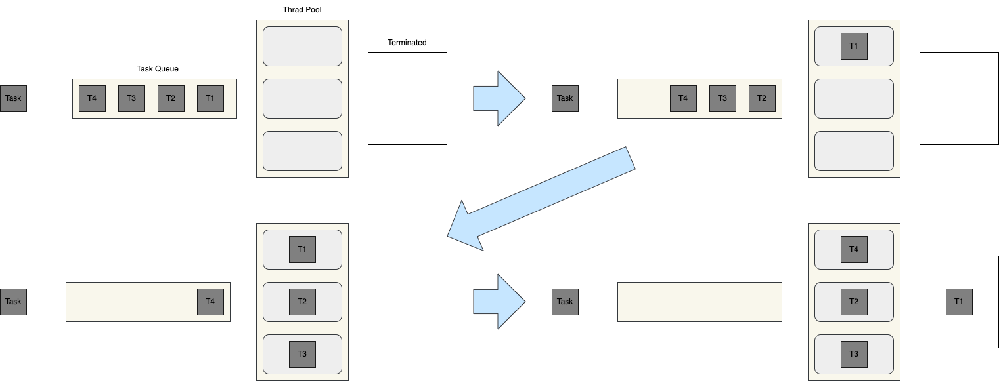

= Thread Pool

== Java Thread Pool
* 여러 개의 thread를 만들어 두고 여러 번 재사용되는 작업자 thread 그룹을 나타낸다.
* Thread pool은 고정 크기로 생성된다.
* Thread pool에 Runnable object를 주고 실행을 요청하면, thread pool에서 thread를 가져와 실행
* thread pool에 thread가 없으면, Runnable object를 queue에 저장하고, thread가 종료되면 queue에서 Runnable object를 가져와 실행
* 실행 중이던 thread는 작업이 완료되면 다시 thread pool에 반환되고, 대기 중인 작업이 있는 경우 다시 실행
* 만약 thread pool에 남아있는 thread가 없다면 유휴 thread가 생길 때까지 해당 작업은 queue에 대기

=== Thread Pool의 장점
* Thread 생성과 삭제에 따른 시간과 자원(resource)를 절약할 수 있음.

=== Thread Pool 주의점
1. *Deadlock*
* Multi-thread와 관련된 모든 프로그램에서 **교착 상태**가 발생할 수 있다.
* 작업 간 데이터 교환이 필요한 경우 실행 작업과 대기 작업의 **교착 상태**가 발생할 수 있음

2. *Thread Leakage*
* 비정상 종료에 의한 실행 종료

3. *Resource Thrashing*
* 지나치게 크게 설정을 할 경우, thread간의 context switching이 느려지는 문제가 발생할 수 있음.

4. *Thread Group*
* Java는 단일 object에서 여러 thread를 그룹화하는 방법 제공
* 단일 함수 호출로 thread group을 pause, resume, stop 할 수 있음.
* 하지만, 안전성의 이유로 사용을 안하는 것을 권장